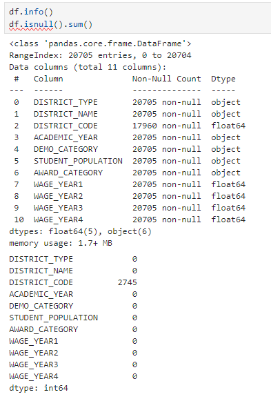
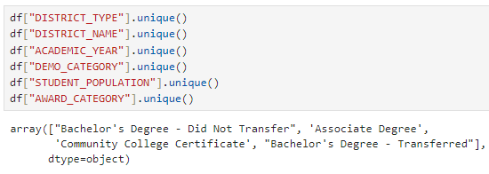
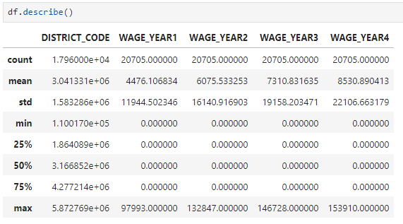
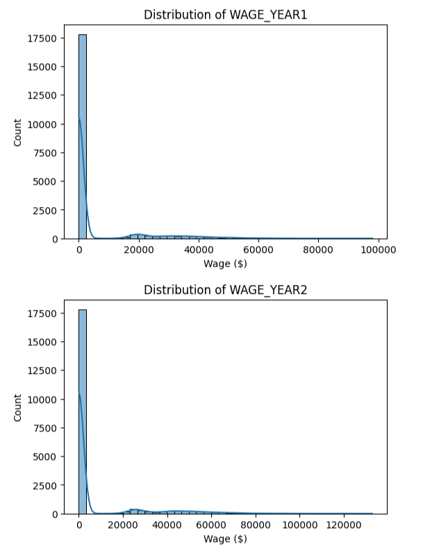
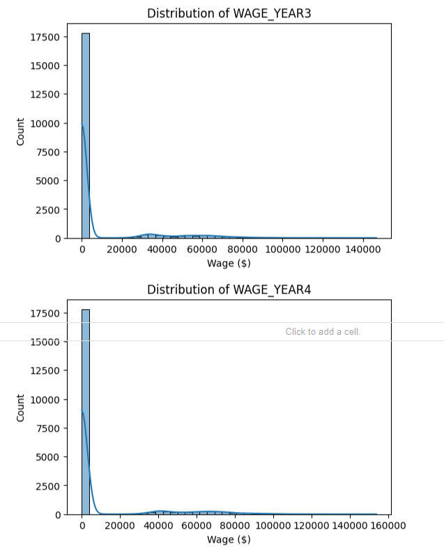

# x62-data-challenge-student-pathways

# Part 1: Data Exploration
1. Data quality: For each feature (column), what is the data type? Is there any missing data?
    
        ● Data Type: Columns consisted of either Object or Float64
            - 6 Object: DISTRICT_TYPE, DISTRICT_NAME, ACADEMIC_YEAR, DEMO_CATEGORY, STUDENT POPULATION, AWARD_CATEGORY
            - 5 float64: DISTRICT_CODE, WAGE_YEAR1, WAGE_YEAR2, WAGE_YEAR3, WAGE_YEAR4
        ● Missing Data:
            - DISTRICT_CODE has 2745 missing values.
            - All the other columns have 0 missing values. 
        ● Explaining the Image:
            - I used df.info() in order to get the Data Types for each column (0-10), by looking at the Dtype column.
            - I used df.isnull().sum() in order to identify how many missing values in each column.
    

2. Range: What are the unique values for each categorical column? 
   What is the range of values of the numeric columns? Are the numeric column values normally distributed?
    
        ● Unique Values: I used .unique() in order to find unique values for each categorical column.
            - The column AWARD_CATEGORY has four unique categories.
                - Bachelor's Degree - Did Not Transfer
                - Associate Degree
                - Community College Certificate
                - Bachelor's Degree - Transferred
    

        ● Range of Values: I used df.describe() in order to identify the range of values.
            - DISTRICT_CODE
                - Min: 1.100170
                - Max: 5.872769
                - Mean: 3.041331
            - WAGE_YEAR1
                - Min: 0
                - Max: 97,993
                - Mean: 4,476
            - WAGE_YEAR2
                - Min: 0
                - Max: 132,847
                - Mean: 6,075
            - WAGE_YEAR3
                - Min: 0
                - Max: 146,728
                - Mean: 7,310
            - WAGE_YEAR4
                - Min: 0
                - Max: 153,910
                - Mean: 8,530
    

        ● Normally Distributed?:
            - The values range widely, meaning because there is many zeroes and a few high earners.
            - This suggests a right-skewed distribution.

      
3. Semantics: What is the meaning of the columns? Are any columns related to other columns? (If so, how?)
    
        ● Column Meanings:
            - DISTRICT_TYPE: Type of school district.
            - DISTRICT_NAME: The name of the specific school district.
            - DISTRICT_CODE: A unique numeric identifier assigned to each district.
            - ACADEMIC_YEAR: The school year when the data was collected. 
            - DEMO_CATEGORY: Demographic groups.
            - STUDENT POPULATION: The student group being measured.
            - AWARD_CATEGORY: The leve or type of post-secondary award earned.
            - WAGE_YEAR1-4: The average earnings reported 1-4 years after graduation.
        ● Relationships between Columns:
            - WAGE_YEAR1-4:
                - Are strongly correlated to each other.
                - Students with higher early wages tend to have higher later wages.
            - DISTRICT_NAME, DISTRICT_TYPE, and DISTRICT_CODE:
                - Organizationally related
                - Each district name/type belong to one unique district code.
            - DEMO_CATEGORY and STUDENT_POPULATION:
                - Both describe characteristics of the same student group
            - AWARD_CATEGORY and WAGE_YEAR4:
                - Award_categroy may influence wage_year4 because different degrees usually correspond to different earnings.

# Part 3: Reflection
1. Which features best predict the target outcome (WAGE_YEAR4)?
    
        ● 

2. What does your model say about the people or populations whose data is provided?
    
        ●

3. What features, if any, would you like to have had to make a better model?
Submission
    
        ●
